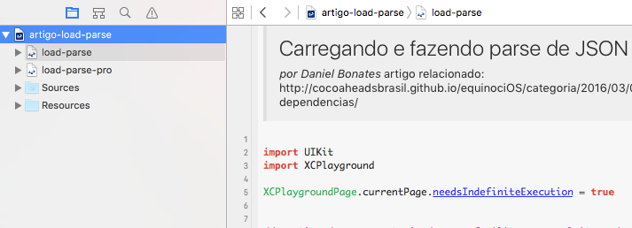

# Playground Web e Json nativo
Swift playground demonstrando o uso de load e parse de json da web sem recorrer a frameworks externos

### Notas:

1. Playground criado como source do artigo 
[postado aqui.](http://equinocios.com/ios/2016/03/02/ios-web-e-json-sem-dependencias/)

2. Esse playground contém duas páginas, cada uma contendo uma versão básica e uma mais avançada. As páginas estão acessíveis pelo Project Navigator (**⌘+1**):

### Dicas!
1. Não deixe de conferir outros top artigos produzidos pelos melhores iOS developers brazucas no site [http://equinocios.com](http://equinocios.com)!
2. [iOSDevBR](https://iosdevbr.slack.com) é uma comunidade de desenvolvedores iOS e interessados no Slack. Chega lá :wink:

--

 Este obra está licenciado com uma Licença <a rel="license" href="http://creativecommons.org/licenses/by-nc/4.0/">Creative Commons Atribuição-NãoComercial 4.0 Internacional</a>.

